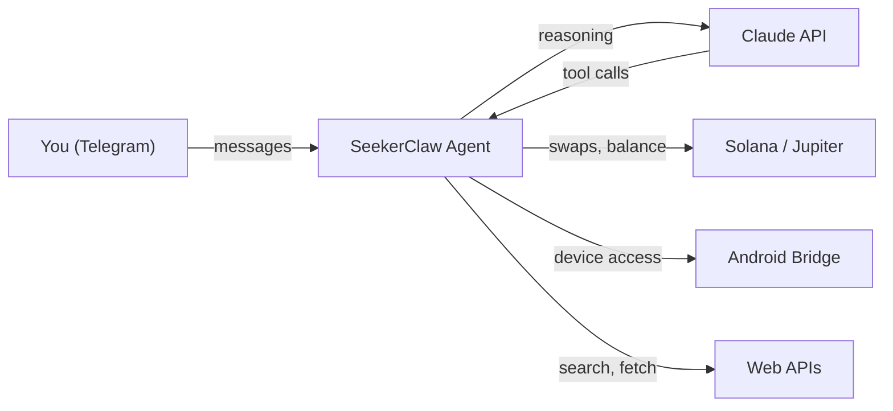

<div align="center">
  
  <h1>SeekerClaw</h1>
  <p><em>AgentOS for Android</em></p>
  <p><strong>A 24/7 AI agent that lives on your phone</strong></p>

  <p>
    
    
    
    
    
    
  </p>
</div>

---

SeekerClaw embeds a Node.js AI agent inside an Android app, running 24/7 as a foreground service. You interact through Telegram — ask questions, control your phone, trade crypto, schedule tasks. **56 tools, 35 skills, Solana wallet**, all running locally on your device. Built for the Solana Seeker, runs on any Android 14+ phone.

<div align="center">
  
  
  
  
  
  
  
</div>

## Features

| | Feature | What it does |
|---|---|---|
| :robot: | **AI Engine** | Claude (Opus / Sonnet / Haiku) with multi-turn tool use |
| :speech_balloon: | **Telegram** | Full bot — reactions, file sharing, inline keyboards, 12 commands |
| :link: | **Solana Wallet** | Swaps, limit orders, DCA, transfers via Jupiter + MWA |
| :iphone: | **Device Control** | Battery, GPS, camera, SMS, calls, clipboard, TTS |
| :brain: | **Memory** | Persistent personality, daily notes, ranked keyword search |
| :alarm_clock: | **Scheduling** | Cron jobs with natural language ("remind me in 30 min") |
| :globe_with_meridians: | **Web Intel** | Search (Brave / DuckDuckGo / Perplexity), fetch, caching |
| :electric_plug: | **Extensible** | 35 skills + custom skills + MCP remote tools |

<details>
<summary><strong>Architecture</strong></summary>

<br>



**On-device stack:**

```
Android App (Kotlin, Jetpack Compose)
 └─ Foreground Service
     └─ Node.js Runtime (nodejs-mobile)
         ├─ claude.js      — Claude API, system prompt, conversations
         ├─ tools.js       — 56 tool handlers + confirmations
         ├─ solana.js      — Jupiter swaps, DCA, limit orders
         ├─ telegram.js    — Bot, formatting, commands
         ├─ memory.js      — Persistent memory + ranked search
         ├─ skills.js      — Skill loading + semantic routing
         ├─ cron.js        — Job scheduling + natural language parsing
         ├─ mcp-client.js  — MCP Streamable HTTP client
         ├─ web.js         — Search + fetch + caching
         ├─ database.js    — SQL.js analytics
         ├─ security.js    — Prompt injection defense
         ├─ bridge.js      — Android Bridge HTTP client
         ├─ config.js      — Config loading + validation
         └─ main.js        — Orchestrator + heartbeat
```

</details>

## Quick Start

**Prerequisites:** Android Studio, JDK 17, Android SDK 35

```bash
git clone https://github.com/sepivip/SeekerClaw.git
cd SeekerClaw
./gradlew assembleDebug
adb install app/build/outputs/apk/debug/app-debug.apk
```

Open the app → scan QR or enter your [Anthropic API key](https://console.anthropic.com/) + [Telegram bot token](https://t.me/BotFather) → choose a model → name your agent → done.

> **Beta** — SeekerClaw is under active development. Expect rough edges and breaking changes. Issues and PRs welcome.

## Links

**Website:** [seekerclaw.xyz](https://seekerclaw.xyz) · **Twitter:** [@SeekerClaw](https://x.com/SeekerClaw)

---

<div align="center">

[Contributing](CONTRIBUTING.md) · [Security](SECURITY.md) · [Changelog](CHANGELOG.md) · [License](LICENSE)

</div>
